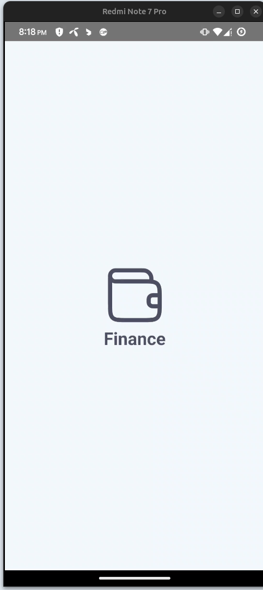
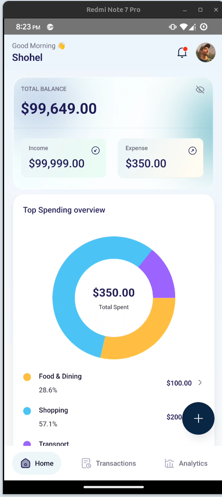

# Finance App – React Native Assessment

A mobile financial dashboard application built for the Techcare React Native Take-Home Project, implementing core UI flows, navigation, state management, and authentication simulation using React Native & Zustand.

This submission includes a working authentication flow, splash screen, bottom tab navigation, transaction listing UI, and reusable components — with clean and scalable architecture set up for further development.

---

## 🚀 Features Implemented

### 1. Splash Screen
- Custom branding
- App icon + title
- Visible for 2 seconds before navigation
- Uses NativeWind + Hugeicons

### 2. Authentication Flow
- Login screen (email/password, icons, styled inputs)
- Signup screen
- Navigation between Login ↔ Signup
- Zustand store to simulate login/logout
- Redirect to Main app after login
- Form input states & validation placeholders

### 3. Navigation
- React Navigation v6+
- Stack Navigator (Splash → Auth → Main)
- Bottom Tab Navigator for main screens
- Navigation flows working smoothly

### 4. Home / Dashboard
- Balance card with show hide system
- Chart
- Recent transactions list UI
- Date formatting
- Swipe actions
- Custom modal for delete

### 5. Transactions
- Transaction card UI (icon, tags, amount, type)
- Date formatting: Friday, Aug 15, 2025
- Delete action UI prepared
- Zustand store structure ready for real data

### 6. State Management
Using Zustand for:
- Auth store (login / logout simulation)
- Transaction store (sample data + helpers)
- Balance store (placeholder for API integration)

### 7. Code Quality
- File structure aligned with requirements
- Reusable components
- Hooks prepared for API integration
- Clean commit history (feature-based)

---

## ❌ Features Not Completed
- Mock API server (JSON Server / MSW)
- Full profile/settings UI
- Receipt generation (share/download)
- Error boundaries
- Dark mode
- Analytics
- Unit & component testing (Jest + RN Testing Library)

---

## 📁 Project Structure
```ssh
src/
├── api/          # API calls and configurations
├── assets/       # Images, fonts, icons
├── components/   # Reusable UI components
├── constants/    # App constants
├── hooks/        # Custom React hooks
├── navigation/   # Navigation configuration
├── screens/      # Screen components
├── store/        # State management (Zustand)
├── types/        # TypeScript types/interfaces
└── utils/        # Utility functions
```

## 🛠 Tech Stack
- React Native (CLI)
- TypeScript / JavaScript
- Zustand – state management
- React Navigation v6
- NativeWind – styling
- Hugeicons – icons
- React Native Chart Kit (partial usage)
- AsyncStorage (optional for auth persistence, pending)

---

## 📦 How to Run the Project

1. **Clone Repository**

```bash
git clone https://github.com/MdHRShohel/techcare-react-native-assessment-md-habibur-rahman-shohel
cd techcare-react-native-assessment-md-habibur-rahman-shohel
```

2. **Install Dependencies**
  
```bash
npm install
# or
yarn install
```

3. **Start Metro**
  
```bash
npm start
# or
yarn start
```

4. **Run App** 

  on Android:
```bash
npm run android
# or
yarn android
```

  on IOS:
```bash
npm run ios
# or
yarn ios
```


## ⏱ Time Breakdown

- Initial Setup: 2 hours

- Splash Screen: 30 min

- Navigation Setup: 1.5 hours

- Authentication (Login + Signup): 2 hours

- Dashboard UI: 6 hours

- Transaction List: 3 hours

- State Management (Zustand): 1 hour

- Bug Fixing & Polish: 2 hours

- Documentation & README: 1 hour

### Total: ~19 hours

## 📌 Notes

This submission focuses on clean structure, scalable design, and functional core flows.
Some advanced features remain incomplete due to the deadline, but foundations are prepared for full implementation.

## 📸 Screenshots







